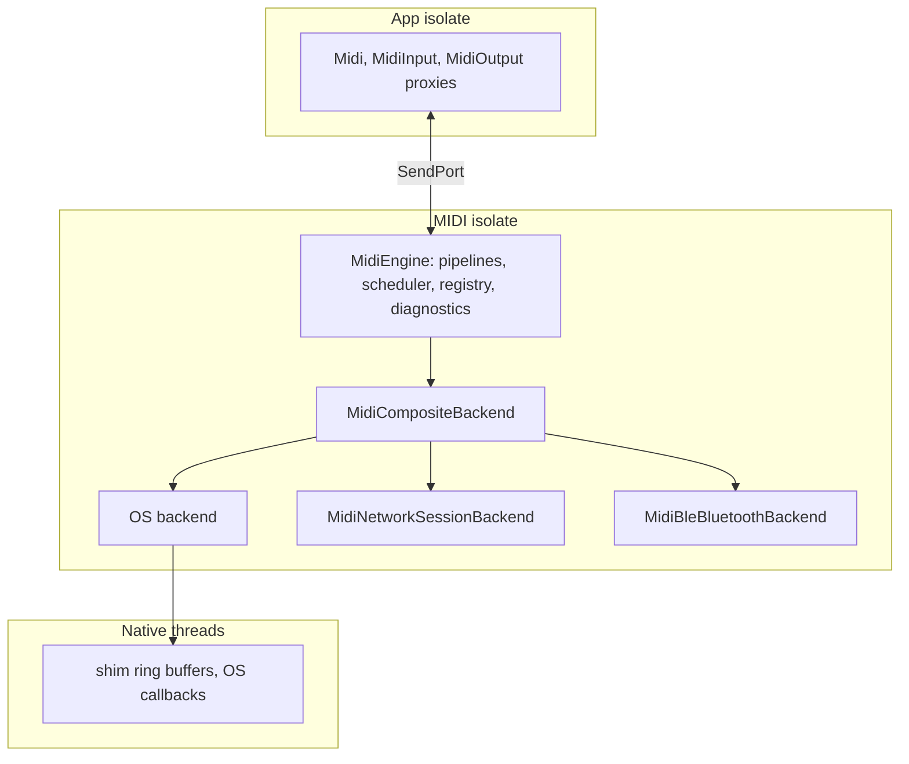

# Architecture

Target picture of the aud_midi package family, as implemented in ticket
audmidi. The plan behind it is
[aud_midi_01](../tickets/2026-10-06-aud_midi_01-initial-midi-implementation.md),
the decisions are in [concepts/decisions](../concepts/decisions/000-index.md).

## Packages

Ten packages, one repo each in `github.com/audmidi`. Diagram:
[img/package-graph.mmd](img/package-graph.mmd).

| Package | Role | Native code | Depends on |
| --- | --- | --- | --- |
| `aud_midi_standard` | MIDI 1.0 / 2.0 as data: messages, `MidiBytes`, `Ump`, byte and UMP codecs, translation, BLE-MIDI framing, constants, models | none | nothing |
| `aud_midi_core` | contracts (`MidiBackend` & co.), clock, `MidiEngine`, composite and BLE backends, `FakeMidiBackend` | none | standard |
| `aud_midi_rtp` | RFC 6295 payload and complete recovery journal, codec only | none | standard |
| `aud_midi_network` | AppleMIDI and Network MIDI 2.0 sessions over UDP, mDNS browsing, session backend | none | standard, core, rtp, `multicast_dns`, `crypto` |
| `aud_midi_apple` | CoreMIDI, `MIDINetworkSession`, CoreBluetooth, Bonjour | C shim + generated ObjC, via hook | standard, core, `objective_c`, `ffi` |
| `aud_midi_android` | `android.media.midi` via jnigen, AMidi via FFI | Java shim (Gradle plugin) | standard, core, `jni` |
| `aud_midi_windows` | WinRT `Windows.Devices.Midi`, optional `Windows.Devices.Midi2` | C++/WinRT shim via hook | standard, core, `win32`, `ffi` |
| `aud_midi_linux` | ALSA sequencer via FFI, BlueZ, Avahi | none (dlopen `libasound.so.2`) | standard, core, `bluez`, `dbus`, `ffi` |
| `aud_midi_web` | Web MIDI via `package:web` | none | standard, core, `web` |
| `aud_midi` | `Midi.open()`, MIDI isolate, proxies, backend selection, examples | none | all of the above |

## Runtime

- The app isolate holds thin proxies. All I/O runs in one MIDI isolate per
  process; other isolates attach through a sendable connector.
- `MidiEngine` hosts one backend: per input a byte parser or UMP decoder,
  optional translation, JR timestamps, a bounded queue; per output
  translation to the port's protocol, encoding and scheduling.
- Scheduling: ports with `scheduledSend` get due times handed to the OS;
  `lookahead` keeps packets cancellable in the engine until shortly before
  they are due. Other ports use the software scheduler.
- Backends deliver and accept raw packets only. Native receive threads
  copy into shim buffers and signal the MIDI isolate; they never call into
  Dart synchronously.
- Losses never error a stream; they become `MidiDiagnostic`s.

## Composition per platform

| Platform | OS backend | Network | Bluetooth LE | Virtual ports |
| --- | --- | --- | --- | --- |
| iOS | `AppleMidiBackend` (CoreMIDI, UMP) | `MIDINetworkSession` | CoreBluetooth + CoreMIDI activation | dynamic |
| macOS | `AppleMidiBackend` | `aud_midi_network` + Bonjour advertiser (`MIDINetworkSession` is inactive on macOS) | CoreBluetooth + CoreMIDI activation | dynamic |
| Android | `AndroidMidiBackend` | `aud_midi_network` + `NsdManager` advertiser | `BluetoothLeScanner` + `openBluetoothDevice` | static (manifest services) |
| Windows | `WindowsMidiBackend` | `aud_midi_network` + `DnsServiceRegister` | pairing API (WinRT MIDI 1.0) | Windows MIDI Services only |
| Linux | `LinuxMidiBackend` (ALSA seq) | `aud_midi_network` + Avahi | BlueZ GATT + core BLE backend | dynamic |
| Web | `WebMidiBackend` (main thread, no MIDI isolate) | – | – | – |

## Verification status

| Package | Verified on this ticket's machine | Not verified |
| --- | --- | --- |
| standard | VM, Chrome (dart2js), Wasm | – |
| core | VM, Chrome | – |
| rtp | VM, lossy-channel property tests | Apple driver interop |
| network | localhost UDP, lossy proxy | Apple driver and Windows MIDI Services interop, IPv6 |
| apple | macOS loopback, iOS simulator | BLE hardware |
| android | emulator API 36, release build with R8 | USB/BLE hardware, API < 33 |
| web | Chrome 153 with CoreMIDI loopback | Firefox, Edge |
| linux | Dart logic, struct layouts on macOS | everything native on Linux |
| windows | Dart logic, portable C++ core | everything native on Windows |
