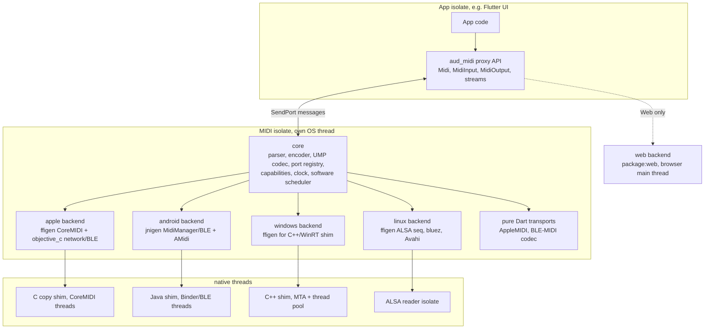
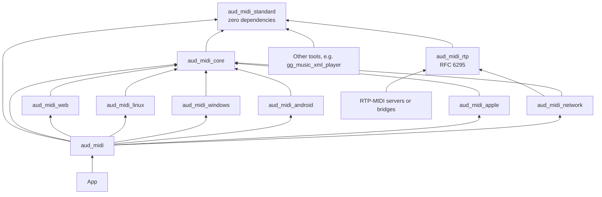

# Plan: MIDI package concept for aud_midi (ticket aud_midi_01)

## Context

Ticket `aud_midi_01` ("Initial MIDI implementation") exists; its only repo
is `aud_midi` (branch `aud_midi_01`), still the untouched
`flutter create --template=package_ffi` boilerplate (`hook/build.dart`,
`src/aud_midi.c`, `ffigen.yaml` with `ffi-native`, deps `hooks`,
`code_assets`, `native_toolchain_c`, `logging`; dev `ffigen ^22`, `helix`).
There is no project management repo, so the plan lives in the ticket repo.

The user wants a **planning document, no code**: an overview of the current
MIDI capabilities of CoreMIDI, Android NDK (AMidi) and JNI
(`android.media.midi`), Web MIDI and Windows MIDI, a look at
`flutter_midi_command`, and a concept for a Dart package that offers USB,
BLE, virtual and network-session MIDI on iOS, macOS, Android, Windows, Web
and (added by the user at plan review) Linux under these constraints:

- as Dart-only as possible, no Flutter dependency
- no platform channels; OS access via FFI (Web has no FFI, `dart:js_interop`
  is the only route — the one inherent exception, to be stated)
- USB MIDI, BLE MIDI, virtual MIDI and network sessions supported

Deliverable: `aud_midi_pm/doc/2026-Q4/tickets/2026-10-06-aud_midi_01-initial-midi-implementation.md`
(exists, untracked, 34 bytes: only `# Plan the package implementation`).

Tooling on this machine: Dart 3.13.4, Flutter 3.47.5 stable, `gg` CLI;
no global prettier/markdownlint (the editor formats on save).

## Conventions that shape the post

- Audanika posts: HTML license comment, `# Title`, `##` sections, no front
  matter. Planning model (aud_pm `08 Visualize tone selections.md`):
  `## Goals` … `## Plan` with `### Decisions`, `### Structure`, `### Steps`,
  `### Verification`. ggdna template adds `## Open Points`. The post merges
  both: Goals / overview sections / Concept / Plan / Open Points.
- License header (repo psi-header template; `LICENSE` says Audanika):

  ```text
  <!--
  @license
  Copyright (c) Audanika

  Use of this source code is governed by terms that can be
  found in the LICENSE file in the root of this package.
  -->
  ```

- English, 80-character wrap (Prettier printWidth 80, proseWrap preserve,
  so wrap by hand), final newline, mermaid in fenced blocks. Keep the
  user's file name and H1.
- Length: the guide says 60–100 lines, "longer for complex tickets"; this
  is a research + concept post, target 350–450 lines, tables for the
  overview, one mermaid diagram, one API sketch.
- CLAUDE.md: create/update `.gg/publish_config.json` (gitignored, absent)
  when the repo changes; `gg do commit` writes CHANGELOG, never by hand.

## Research results (sources fetched 2026-10-06)

### Apple: CoreMIDI (macOS, iOS, iPadOS, Catalyst, visionOS)

- C API in `CoreMIDI.framework`; network session classes are Objective-C.
- Enumeration: `MIDIGetNumberOfSources/Destinations`, `MIDIGetSource/
  Destination`, device → entity → endpoint, `MIDIObjectGetStringProperty`
  (`kMIDIPropertyName`, `DisplayName`, `Manufacturer`, `UniqueID`,
  `Offline`, `DriverOwner`).
- Client/ports: `MIDIClientCreate` (`MIDINotifyProc` runs on the run loop
  of the creating thread) or `MIDIClientCreateWithBlock` (thread chosen by
  the implementation); `MIDIInputPortCreate` + `MIDIReadProc` / `MIDISend`
  with `MIDIPacketList` (deprecated since macOS 11 / iOS 14, still works);
  `MIDIInputPortCreateWithProtocol` + `MIDIReceiveBlock`,
  `MIDISendEventList` with `MIDIEventList` = UMP (macOS 11+ / iOS 14+).
  `MIDIPacketNext`, `MIDIPacketListInit`, `MIDIEventListAdd` are inline
  functions/macros (ffigen cannot bind them); `MIDIPacket` is packed.
- Notifications: `kMIDIMsgSetupChanged`, `ObjectAdded/Removed`,
  `PropertyChanged`, `IOError` → hotplug.
- Virtual endpoints: `MIDISourceCreate(WithProtocol)`,
  `MIDIDestinationCreate(WithProtocol)`, `MIDIReceived(EventList)`;
  creators may set `kMIDIPropertyUniqueID` so other apps' saved
  connections survive. iOS: visible while the app runs; background needs
  the `audio` background mode.
- BLE MIDI: in-box since iOS 8 / OS X 10.10 (QA1831), connected
  peripherals appear as ordinary endpoints. Programmatic path (iOS 16+ /
  macOS 13+): CoreBluetooth scan for service
  `03B80E5A-EDE8-4B33-A751-6CE34EC4C700`, connect, call
  `MIDIBluetoothDriverActivateAllConnections()`, confirm via
  `MIDIDeviceRef`, then disconnect the CoreBluetooth side. Below that: OS
  UI only (`CABTMIDICentralViewController` is UIKit, Audio MIDI Setup on
  macOS). Peripheral role: UI only, no programmatic API.
- Network: `MIDINetworkSession` (iOS 4.2+, SDK header says macOS 10.15,
  docs 10.11, Catalyst 13.1+): `defaultSession`, `enabled`, `networkName`,
  `localName`, `connectionPolicy` (Anyone / Contacts / SpecificPeers),
  `contacts` (`MIDINetworkHost` by name+address+port or Bonjour service),
  `connections`, `sourceEndpoint` / `destinationEndpoint` (ordinary
  endpoints), Bonjour `_apple-midi._udp`, notifications
  `ContactsDidChange` / `SessionDidChange`. Protocol = AppleMIDI: RTP-MIDI
  (RFC 6295) over UDP, control + data port (5004/5005), IN/OK/NO/BY, CK
  three-way clock sync (100 µs units, ≥ every 60 s), RS feedback,
  recovery journal (sender always J=1, receiver may ignore). Enabling the
  session is global, cross-app state ("Session 1" in Audio MIDI Setup).
- MIDI 2.0: UMP event lists (macOS 11+ / iOS 14+), `MIDIUMPEndpoint`,
  `MIDIUMPMutableEndpoint`, MIDI-CI (macOS 15+ / iOS 18+).
- Timestamps: `MIDITimeStamp` = `mach_absolute_time` ticks (timebase
  ratio); future timestamps schedule output; `MIDIFlushOutput` cancels.
  Read callbacks arrive on CoreMIDI threads and the packet list is reused
  after the callback returns.

### Android: NDK AMidi (API 29+, `libamidi.so`, not shipped below 29)

- `AMidiDevice_fromJava(JNIEnv*, jobject MidiDevice, AMidiDevice**)`,
  `AMidiDevice_release`, `getType` (USB / VIRTUAL / BLUETOOTH),
  `getNumInputPorts/getNumOutputPorts`, `getDefaultProtocol` (API 33).
- Receive: `AMidiOutputPort_open/close/receive` — **non-blocking poll**
  (opcode DATA/FLUSH, bytes, `CLOCK_MONOTONIC` ns). Send:
  `AMidiInputPort_open/close/send/sendWithTimestamp/sendFlush`.
- Needs the Java `MidiDevice` from `MidiManager` → JNI unavoidable. No
  enumeration, hotplug, BLE or virtual device in the NDK.

### Android: JNI `android.media.midi` (API 23+, feature `android.software.midi`)

- `MidiManager` (`context.getSystemService(MIDI_SERVICE)`): `getDevices()`
  (deprecated 33), `getDevicesForTransport(BYTE_STREAM | UMP)` (33),
  `openDevice(info, listener, handler)`, `openBluetoothDevice(
  BluetoothDevice, listener, handler)`, `registerDeviceCallback(...)`.
- `OnDeviceOpenedListener` is an **interface**; `DeviceCallback`,
  `MidiReceiver`, `ScanCallback`, `BroadcastReceiver`, `MidiDeviceService`
  are **abstract classes** (not implementable from Dart via jnigen).
- `MidiDeviceInfo`: `TYPE_USB/VIRTUAL/BLUETOOTH`, properties (name,
  manufacturer, product, serial), `PortInfo`, `getId()` is re-assigned on
  re-plug, `getDefaultProtocol` (33). Android "input port" = data *into*
  the device.
- `MidiDevice.openInputPort(n)` (send), `openOutputPort(n).connect(
  MidiReceiver)` (receive), `close`.
- Virtual: `MidiDeviceService` (23) / `MidiUmpDeviceService` (33), a
  `Service` declared in the manifest with a static `midi_device_info` XML;
  the system may start it before any Dart isolate exists.
- BLE: `BluetoothLeScanner.startScan(filters, settings, ScanCallback)` →
  `openBluetoothDevice`. Permissions: API 31+ `BLUETOOTH_SCAN`
  (`neverForLocation`) + `BLUETOOTH_CONNECT`; ≤ 30 `BLUETOOTH`,
  `BLUETOOTH_ADMIN`, `ACCESS_FINE_LOCATION`. The app owns the connection,
  no system auto-connect (so Chrome on Android has no BLE MIDI either).
- Network: no OS support; mDNS receive needs `CHANGE_WIFI_MULTICAST_STATE`
  + `WifiManager.MulticastLock`; advertising via `NsdManager`.
- USB permission dialogs are handled by the system MIDI service.

### Windows

- **WinMM** (MIDI 1.0 legacy): `midiInOpen` (driver-thread callback),
  `midiInStart`, `midiInAddBuffer` (sysex), `midiOutOpen`,
  `midiOutShortMsg/LongMsg`; no hotplug events, no virtual ports, no BLE,
  no network, single client unless replumbed. Bound in Dart `win32` 6.4.0.
- **WinRT `Windows.Devices.Midi`** (Windows 10 10240+, desktop apps too):
  `MidiInPort/MidiOutPort.FromIdAsync`, `GetDeviceSelector`,
  `MessageReceived` (`RawData`, `Timestamp` = TimeSpan since open, 100 ns
  units), `DeviceWatcher` hotplug, multi-client, `MidiSynthesizer`.
  **BLE MIDI since 1607** (paired devices appear; in-app pairing via
  `Windows.Devices.Enumeration` pairing APIs). No virtual ports, network,
  UMP or scheduling. Headers ship in the Windows SDK (cppwinrt).
- **Windows MIDI Services** (`midisrv.exe`): Windows 11 25H2+ only, 24H2
  excluded. Microsoft's overview describes the service as already in-box
  for everyone on 25H2+ with updates enabled, the release notes (In-box
  Preview 10, 2026-10-04) describe a staged rollout of the new API from
  late November 2026 — so the architecture relies on **runtime
  detection**, never on a date. API is in-box **`Windows.Devices.Midi2`**
  (no bootstrapper any more; detect with `ApiInformation.IsTypePresent` /
  `MidiApi.EnsureServiceAvailable`);
  headers come from NuGet until they land in the Windows SDK. Classes:
  `MidiSession`, `MidiEndpointConnection`, `MidiEndpointDeviceInformation`,
  `MidiEndpointDeviceWatcher`, `MidiMessage32/64/96/128`, `MidiClock`
  (timestamps, scheduling), `MidiVirtualDeviceManager` (app-to-app),
  `MidiLoopbackEndpointManager`, `MidiNetworkEndpointManager`, MIDI-CI.
  In-box transports: USB (KS, KSA), DIAG, MIDI 1.0 loopback, MIDI 2.0
  loopback, APP (virtual device). Preview transports package: BLE MIDI 1.0,
  Network MIDI 2.0, RTP-MIDI 1.0, GM synth. WinMM/WinRT MIDI 1.0 are
  replumbed through the service.
- Dart WinRT projections (`dartwinrt`, `windows_devices`) discontinued
  2024-09-16 → WinRT needs a C++/WinRT shim; COM delegates cannot be
  implemented in pure Dart across threads (listeners return void, COM
  needs HRESULT). Flutter's main thread is STA.

### Linux: ALSA sequencer, BlueZ, Avahi

- **ALSA sequencer** (`libasound.so.2`, `snd_seq_*`): the standard Linux
  MIDI layer, also under PipeWire (its ALSA-seq bridge) and for JACK users.
  Enumeration of clients/ports (`snd_seq_query_next_client/port`, port
  capabilities and types), own client with **virtual ports** as a native
  concept (`snd_seq_create_simple_port`, any app can create them,
  dynamic), subscriptions (`snd_seq_connect_from/to`), hotplug via the
  system announce port (`SND_SEQ_EVENT_CLIENT_START/EXIT`,
  `PORT_START/EXIT/CHANGE`), input via `snd_seq_event_input` (blocking or
  non-blocking + `snd_seq_poll_descriptors`), scheduled output through
  queues (`snd_seq_alloc_queue`, real-time timestamps,
  `snd_seq_ev_schedule_real`), sysex as variable-length events, USB via
  the `snd-usb-audio` kernel driver. **ALSA RawMIDI** (`snd_rawmidi_*`) is
  the device-level alternative without routing or virtual ports.
- **MIDI 2.0**: kernel 6.5+ (refined through 6.12) with `CONFIG_SND_UMP`,
  `CONFIG_SND_SEQ_UMP`, `CONFIG_SND_USB_AUDIO_MIDI_V2`; alsa-lib 1.2.10+
  adds `snd_seq_ump_event_t`, UMP sequencer clients and UMP endpoints;
  PipeWire gained UMP in 2026.
- **BLE MIDI**: BlueZ has a MIDI profile that creates ALSA ports for
  connected BLE MIDI peripherals, but it needs `--enable-midi`, which
  Ubuntu, Debian, Fedora and Arch leave off. Reliable path: own BLE-MIDI
  GATT client over BlueZ D-Bus using the pure-Dart `bluez` 0.8.3 package
  (Canonical, on `dbus`): `startDiscovery` with the MIDI service UUID,
  `connect`, `gattServices`, characteristic `startNotify` /
  `writeValue`, plus our BLE-MIDI framing codec. Peripheral role via
  BlueZ GATT server D-Bus API (later).
- **Network**: no OS session; pure-Dart AppleMIDI like on Android/
  Windows; advertising through Avahi's D-Bus API
  (`org.freedesktop.Avahi.Server` → `EntryGroupNew`, `AddService`,
  `Commit`, via `dbus`; the `avahi` 0.1.0 package is minimal), browsing
  via `multicast_dns` or Avahi.
- Dart access: pure Dart, `DynamicLibrary.open('libasound.so.2')` with
  ffigen bindings (ALSA headers only needed at generation time); blocking
  `snd_seq_event_input` in a helper isolate (own thread, events are
  read synchronously, no dangling pointers), stop via a wake-up event to
  our own port. No hook build needed on Linux. Prior art: `midi` 0.1.1.
- Sandboxes: Snap needs the `alsa` (and `bluez`, `avahi-control`,
  `network`) interfaces, Flatpak `--device=all` plus
  `--system-talk-name=org.bluez` / `org.freedesktop.Avahi`.
- CI: ubuntu runners need `libasound2` (`libasound2-dev` for ffigen) and
  `/dev/snd/seq` (`modprobe snd-seq`); loopback test = two virtual ports
  of the own client connected to each other, no hardware.

### Web MIDI

- `navigator.requestMIDIAccess({sysex, software})`: secure context,
  permission prompt (sysex is a stronger prompt), `Permissions-Policy:
  midi`. `inputs/outputs`, `onstatechange` (hotplug), `onmidimessage`
  (`Uint8Array` + `DOMHighResTimeStamp`), `send(data, timestamp)`
  (scheduling), `clear()`, port `id/name/manufacturer/state/connection`.
  `send()` throws on running status or partial sysex.
- No UMP, no virtual ports, no network; BLE only via OS pairing on
  macOS/Windows, none on Android, no iOS browser.
- Support (caniuse): Chrome 43+, Edge 79+, Opera 30+, Firefox 108+, Chrome
  Android, Samsung Internet; no Safari (3rd-party extension on macOS), no
  Firefox Android; ~81 % global. Web Bluetooth: Chrome 56+, Edge 79+,
  Opera 43+, Chrome Android; no Firefox/Safari.
- Dart: `package:web` 1.1.1 has `MIDIAccess`, `MIDIInput`, `MIDIOutput`,
  `MIDIOptions` …; `requestMIDIAccess` may need a one-line js_interop
  extension on `Navigator`.

### flutter_midi_command 1.3.0 (BSD-3, invisiblewrench)

- Federated **Flutter plugin on platform channels**: darwin (CoreMIDI),
  android (`android.media.midi`), windows (WinMM, port pairing), linux
  (ALSA), web (Web MIDI); optional `flutter_midi_command_ble` (Dart BLE via
  `universal_ble`, own BLE-MIDI framing, Apple hand-off to CoreMIDI).
- API: `devices`, `connectToDevice`, `sendData`, `onMidiDataReceived`
  (typed parser with running status + sysex), `onMidiSetupChanged`,
  `startBluetooth`/`startScanningForBluetoothDevices`, `addVirtualDevice`/
  `removeVirtualDevice` (iOS, macOS, Android), `setNetworkSessionEnabled`
  (Apple). Matrix: USB everywhere; BLE iOS/macOS/Android/Windows; virtual
  iOS/macOS/Android; network Apple only. Min iOS 11, macOS 10.13, Android
  21. Known issue: Android BLE rescans after disconnect.
- Not reusable: Flutter dependency, channels, no MIDI 2.0, no network
  outside Apple, no timestamps, Linux without BLE/virtual/network. Good
  reference for API shape and the BLE hand-off.

### Dart interop toolbox (Oct 2026)

- `dart:ffi` + `NativeCallable.listener` (any thread, returns void,
  delivered **asynchronously**: pointer arguments must outlive the call)
  / `isolateLocal`; `isolateGroupBound` exists in 3.13 but experimental.
- Hooks: `hook/build.dart` + `hooks` 2.x + `code_assets` 2.1 +
  `native_toolchain_c` 0.19.5 (`Language.c/cpp/objectiveC`, `frameworks`,
  `libraries`, `std`, `flags`; clang/NDK/MSVC). Stable since Dart 3.10 /
  Flutter 3.38; not for Web. `DynamicLoadingSystem` code assets for OS
  libraries such as `libamidi.so`.
- `ffigen` 22.0.0: C and ObjC (interfaces, protocols with listener/
  blocking methods, blocks `fromFunction/listener/blocking`, block-typed C
  parameters supported), may emit a `.m` to compile via the hook; `ffi-
  native` with asset ids (both labelled experimental). `objective_c` 9.6.2:
  no Flutter dependency, builds with hooks.
- `jni` 1.1.0 / `jnigen` 1.0.1 / `jni_flutter` 1.0.3: `jni` is a Flutter
  plugin on Android (`JniPlugin`, Flutter ≥ 3.35.6) without a Flutter
  dependency in Dart; Dart implements Java **interfaces** (`JImplementer`,
  listener methods from any thread) but cannot subclass abstract classes;
  `Jni.getJavaVM()`; the Android `Context` moved to `jni_flutter`, which
  depends on Flutter.
- `win32` 6.4.0, `package:web` 1.1.1, `multicast_dns` 0.3.3+1 (queries
  only), `dbus` 0.7.x / `bluez` 0.8.3 / `avahi` 0.1.0 (Canonical, pure
  Dart, Linux). Prior art: `midi` 0.1.1 (ALSA via FFI, pure Dart),
  `libremidi` 5.x (C++20, BSD-2, many backends, C API) — rejected as a
  dependency.
- MIDI Association **Network MIDI 2.0 (UDP)** M2-124-UM v1.0 (2024-11):
  mDNS `_midi2._udp`, sessions, ping, UMP data with FEC/retransmission,
  optional auth; incompatible with RTP-MIDI; Windows MIDI Services ships
  it, Apple does not.

### Workspace facts

- `gg_midi_vars` 1.0.5 (`MidiNoteNumbers`, `MidiControllers`, pure Dart,
  repo `audanika/gg_midi_vars`) is absorbed into `aud_midi_standard`;
  legacy `audio_engine` (FFI `playMidi`, C++ `MidiParser`) and
  the 2021 "MIDI Lock" post (sources, transformers, gate, destinations)
  describe a routing layer above this package.
- `aud_midi` has only the `dna_vscode` and `dna_github` layers: no blog,
  index or README guide, no `index.jsonc`, stale template README.

## Decisions confirmed by the user (2026-10-06)

1. **Native layer: Dart-first bindings.** ffigen on CoreMIDI, CoreBluetooth
   and `MIDINetworkSession` (via `objective_c`), jnigen on
   `android.media.midi` plus AMidi, `package:web` in the browser. Shims
   only where unavoidable. libremidi and a uniform C shim were rejected.
   Refinement from the review: the Apple shim is a small *C* file after
   all, because CoreMIDI reuses packet lists after the callback returns
   and listener callbacks run later — the C read proc copies the packets
   into a ring buffer and only then signals Dart (`NativeCallable.
   listener`). The same file does packet iteration/building (inline
   CoreMIDI helpers) and uses `MIDIClientCreateWithBlock` for hotplug.
2. **Android: Java shim, no MethodChannel.** Subclasses of `ScanCallback`,
   `DeviceCallback`, `MidiReceiver`, `MidiDeviceService` forward to Java
   interfaces Dart implements through jnigen; a manifest `ContentProvider`
   in the shim captures the application `Context` (no `jni_flutter`
   needed), `Midi.open(androidContext:)` as override. Refinement proposed
   for review: ship the shim as a sibling package `aud_midi_android`
   (like `jni_flutter`) so `aud_midi` stays free of Gradle and pub.dev
   platform tags stay correct. On Android the shim package is a hard
   requirement — there is exactly one integration path — because even
   AMidi needs an opened Java `MidiDevice`, JNI initialisation and the
   `Context`; a "without shim" fallback would not remove any of that.
   Proven by a mandatory early spike (step 0): a small Android app opens
   a USB port, receives and sends through the planned path, in a release
   build with R8 (keep rules for the shim classes used via JNI).
3. **Network: OS session on Apple, pure Dart elsewhere.** `MIDINetworkSession`
   on iOS/macOS; own AppleMIDI in Dart (`RawDatagramSocket`) on Android/
   Windows/Linux. Refinement: no own mDNS responder — joining needs
   host:port only, advertising uses OS registrars reachable through the
   shims (`NsdManager.registerService` via JNI, `DnsServiceRegister` in
   `dnsapi.dll` via FFI, Avahi D-Bus), browsing uses `multicast_dns`
   queries. RFC 6295 is its own package `aud_midi_rtp` (step 9) **with
   the complete recovery journal on both sides** (user decision at plan
   review): sender journals in every packet with the closed-loop policy
   (AppleMIDI's RS receiver feedback takes the place of RTCP), receiver
   repairs every loss per chapter so that the "recovery journal mandate"
   holds — no indefinite artifacts. AppleMIDI sessions on top of it are
   step 10 in `aud_midi_network`; Network MIDI 2.0 (UDP, UMP native) is
   step 12.
4. **Message model: full UMP support from the start (changed by the user
   at plan review).** Two independent raw forms, `MidiBytes` (MIDI 1.0
   byte stream) and `Ump` (32-bit words, 1–4 per packet, with group), one
   typed sealed hierarchy covering MIDI 1.0 and MIDI 2.0 messages, and
   explicit, complete translation in both directions. UMP coverage: MT0
   Utility (NOOP, JR Clock, JR Timestamp, Delta Clockstamp), MT1 System
   Common/Real-Time, MT2 MIDI 1.0 Channel Voice, MT3 SysEx7, MT4 MIDI 2.0
   Channel Voice (note on/off with attribute, 32-bit CC, registered and
   assignable controllers incl. relative and per-note, per-note pitch
   bend and management, program change with bank, 16/32-bit pressure and
   pitch bend), MT5 SysEx8 and Mixed Data Set, MTD Flex Data (tempo,
   time/key signature, metronome, chord, text), MTF UMP Stream (endpoint
   discovery/info, device identity, names, stream configuration
   request/notification, function block discovery/info/name, clip start/
   end). Groups and function blocks stay in the model; MIDI 1.0 ↔ MIDI
   2.0 channel-voice translation follows the UMP spec's conversion rules
   (bit scaling, RPN/NRPN ↔ registered/assignable controllers, bank
   select folding). Byte-stream ports map to one configurable group;
   UMP messages without a MIDI 1.0 equivalent are dropped on byte ports
   with a diagnostic. Every backend uses the native UMP path where the
   OS has one and the translation elsewhere (see the transport matrix).
   MIDI-CI (profiles, property exchange) is not part of this scope; UMP
   1.1 stream configuration replaces MIDI-CI protocol negotiation.
5. **Linux added (user request at plan review).** ALSA sequencer via
   ffigen in pure Dart (no shim, no hook build): OS ports, native dynamic
   virtual ports, announce-port hotplug, queue scheduling. BLE central
   over BlueZ D-Bus with the `bluez` package and our own BLE-MIDI codec
   (the same codec serves Web Bluetooth and BLE peripheral later).
   Network via pure-Dart AppleMIDI with Avahi D-Bus advertising. ALSA
   UMP (kernel 6.5+, alsa-lib 1.2.10+) as the native UMP path, MIDI 1.0
   sequencer events plus translation on older systems.
6. **MIDI I/O lives in its own thread (user requirement at plan review).**
   `Midi.open()` spawns one long-lived **MIDI isolate** per process. A Dart
   isolate runs on its own OS thread, so nothing the main/UI isolate does
   (frame building, awaiting, blocking calls) delays it. The MIDI isolate
   owns every native client, port and handle, every `NativeCallable.
   listener`, ObjC listener block and jnigen listener implementation, the
   software scheduler, the AppleMIDI sockets and clock sync, and the BLE
   GATT sessions. The public API in the app's isolate is a thin proxy
   that talks to it over `SendPort`s (commands as records, MIDI data as
   `Uint8List`); every isolate may hold its own proxy, so timing-critical
   app code can run in a worker isolate next to the UI. Native receive
   threads (CoreMIDI, Java, WinRT thread pool, ALSA reader isolate) only
   copy into buffers and signal the MIDI isolate, so they are never
   blocked by Dart either. Output timing uses OS scheduling with
   timestamps wherever it exists, because Dart isolates of one isolate
   group still share GC pauses; input events carry OS timestamps, so
   their timing stays exact even when the app's isolate is busy. Web is
   the exception: Web MIDI exists only on the browser main thread.
7. **Split into sub-packages (user request at plan review).** One repo
   per package in the `audanika` organisation, all prefixed `aud_midi_`:
   a **dependency-free standard package** `aud_midi_standard` that
   implements the MIDI 1.0 and MIDI 2.0/UMP standards with all data
   models, constants and codecs and absorbs `gg_midi_vars` (user
   request), a small runtime-contracts core, a **dedicated RFC 6295
   package** `aud_midi_rtp` (RTP-MIDI payload format and the complete
   recovery journal, codec only, no sockets; user request), one
   network-session package, one backend package per operating system and
   the app-facing umbrella `aud_midi`. Details in "Package family" below.
   The umbrella is what apps depend on; the others are usable on their
   own.

## Package concept (content of the post)

### Architecture



- One package `aud_midi`, no Flutter dependency, backend chosen by
  conditional export (`if (dart.library.js_interop)` web, `if (dart.
  library.io)` io, stub otherwise — not `dart.library.ffi`, which is also
  true under dart2wasm).
- `MidiBackend` interface + `FakeMidiBackend` for tests and Web test runs.
- **Ports are the primary entity**: `midi.inputs` / `midi.outputs`
  (`MidiInput`, `MidiOutput`, direction from the app's view), `port.device`
  nullable grouping, `MidiPortId` opaque per session plus `fingerprint`
  (manufacturer|product|serial|index) that yields re-plug *candidates*
  only — identical devices without serial number cannot be told apart,
  the app resolves such ambiguity —, `midi.changes:
  Stream<MidiPortEvent>` (added/removed/changed).
- Lifecycle: `Midi.open()` spawns (or attaches to) the MIDI isolate and
  returns a proxy; one proxy per isolate, `close()` on `Midi`, inputs and
  outputs; the last `close()` shuts the MIDI isolate down. The
  `FakeMidiBackend` can run in-isolate for unit tests.
- Shutdown order (own architecture point): `close()` first stops the
  native sources (disconnect/close ports, stop reader and poller
  isolates, dispose watchers), then waits until no native callback is in
  flight (ring-buffer handshake: producer marks "closed", consumer drains
  or discards), cancels the scheduler and announced queue contents, and
  only then closes the `NativeCallable`s, releases listener blocks and
  Java listeners and frees the buffers — calling a closed
  `NativeCallable` is undefined behaviour.
- Ring buffers in the shims: one producer (the native thread of one
  port), one consumer (the MIDI isolate), lock-free SPSC or a short
  mutex; memory owned by the shim, Dart copies out; overflow drops the
  newest batch and increments a counter that becomes a diagnostic; a
  batch may hold several messages but keeps every message's own
  timestamp.
- Errors: sealed `MidiException` — `MidiUnsupported`,
  `MidiPermissionDenied`, `MidiPortGone`, `MidiNativeError(code, api)`;
  streams never error, port loss is a `changes` event.
- Messages: `MidiEvent(message, time, port, group)`, sealed `MidiMessage`
  with MIDI 1.0 types (0-based channels, optional NoteOff normalisation)
  and MIDI 2.0 types (`NoteOn2` with 16-bit velocity and attribute,
  `ControlChange2`, `RegisteredController`, `AssignableController`,
  per-note controllers/pitch bend/management, `ProgramChange2` with
  bank, 32-bit pitch bend and pressure, Flex Data and UMP Stream
  messages), plus two raw forms independent of each other: `MidiBytes`
  and `Ump`. Conversions are explicit (`toUmp(group:)`, `toBytes()`,
  `toMidi2()`, `toMidi1()`) and follow the UMP spec translation rules; no
  message is forced to have a byte representation. Codec coverage: MT0,
  MT1, MT2, MT3, MT4, MT5, MTD, MTF plus the MT2 ↔ MT4 channel-voice
  translation. Ports carry `protocol` (midi1 | midi2), `groups` and
  function-block info where the OS exposes them; a byte port states
  which group it maps to. Raw `input.packets` / `input.ump` streams next
  to typed `messages`; parser reassembles fragmented sysex (SysEx7 and
  SysEx8) with a size cap and a maximum duration for incomplete
  transfers, keeps interleaved real-time messages in order; encoder never
  emits running status; JR timestamps are consumed on input and optional
  on output.
- Data loss and recovery: bounded input queues with a documented overflow
  policy (drop newest, count); every loss is a `MidiDiagnostic` on
  `midi.diagnostics` (port, kind: queue overflow, parser reset, network
  loss, native error, scheduler late; count, cause); after any gap the
  parser resets (drops partial sysex, clears running status);
  `output.panic()` / `midi.panic()` send All Notes Off, All Sound Off and
  Reset All Controllers per channel, configurable; "streams never error"
  stays, but losses are always visible through diagnostics.
- Time and scheduling: `extension type MidiTime(int microseconds)` on one
  monotonic package clock, per-backend conversion (mach ticks,
  `CLOCK_MONOTONIC`, WinRT TimeSpan since open with a QPC base,
  `performance.now()`). Three separate per-port capabilities:
  `timestampsIn` (input events carry OS timestamps), `scheduledSend`
  (the port accepts a future `at:` — CoreMIDI, AMidi
  `sendWithTimestamp`, ALSA queues, Web MIDI, Midi2; the OS or driver
  decides how precisely it honours it, e.g. Android USB uses a software
  scheduler in the MIDI service) and `cancelPending` (`MIDIFlushOutput`,
  Android `flush`, Web `clear()`, ALSA queue drain). Contract of
  `send(message, {MidiTime? at})`: `at` is on the package clock, a past
  or absent `at` sends immediately, the returned `Future` completes when
  the message was accepted into the port's queue (not when it left the
  device), ports without `scheduledSend` get the Dart `Timer` scheduler
  of the MIDI isolate; `cancelPending()` discards queued messages and
  says so by name.
- Threading (decision 6): all I/O runs in the MIDI isolate on its own OS
  thread. Native callbacks copy data in the shim (C ring buffer, Java
  byte array, C++ `RawData` copy) and signal the MIDI isolate via
  `NativeCallable.listener` / jnigen listener interfaces; Linux reads
  ALSA events synchronously in a separate reader isolate with its own
  `snd_seq_t` handle (output handle stays in the MIDI isolate); the
  Android AMidi polling path is a poller isolate. FIFO per port, a whole
  packet list becomes one Dart event with per-message timestamps.
  `NativeCallable.listener` delivers asynchronously without any upper
  bound, so the plan promises no latency figure; it promises that the
  MIDI isolate is never blocked by the app isolate, and the benchmarks
  measure the rest. Sends issued from a busy app isolate are delayed by
  that isolate alone; scheduled sends (`at:`) already sit in the MIDI
  isolate or the OS queue. No blocking blocks (would stall CoreMIDI's
  thread). Shared GC pauses of the isolate group are the remaining
  jitter source; OS timestamps in both directions keep timing exact.
- `MidiCapabilities` per platform (virtual ports: dynamic/static/none,
  BLE scan, network, UMP, `missingPermissions`) plus per-port flags
  (`timestampsIn`, `scheduledSend`, `cancelPending`).
- Sub-APIs: `virtualPorts.createSource/createDestination(name, uniqueId:)`,
  `bluetooth.scan(): Stream<MidiBlePeripheral>` + `connect({timeout})`
  returning the resulting ports, `network.enable(name:)`,
  `network.connect(host, port): Future<MidiNetworkConnection>`,
  `bluetooth.advertise(name:) : Future<MidiBlePeripheralPort>` (the app as
  a BLE-MIDI peripheral, see "BLE peripheral" below).

### BLE peripheral (the app as a BLE-MIDI device)

The app advertises the standard BLE-MIDI GATT service and a central (a
Mac, an iPad, a DAW, a phone) connects to it. In scope for all
platforms except Web.

- **Wire format:** BLE-MIDI service `03B80E5A-EDE8-4B33-A751-6CE34EC4C700`,
  one characteristic `7772E5DB-3868-4112-A1A9-F2669D106BF3` (read,
  write without response, notify). Packet framing with timestamp bytes
  and sysex continuation is the same pure-Dart codec as for the central
  role and lives in `aud_midi_standard`; negotiated MTU decides the
  packet size.
- **Result is our own port**, not an OS device: `bluetooth.advertise()`
  yields a `MidiBlePeripheralPort` (an input and an output, `isOwn`,
  transport `bluetoothLe`) that behaves like any virtual port, plus a
  stream of connected centrals. The OS MIDI stack does not see it, so
  other apps on the same machine cannot use it; apps on the central use
  the app's data directly.
- **Apple:** `CBPeripheralManager` with the service, advertising,
  notifications via `updateValue`. `CABTMIDILocalPeripheralViewController`
  is UIKit and stays out of the Dart-only scope.
- **Android:** `BluetoothGattServer` and `BluetoothLeAdvertiser`; the
  abstract `BluetoothGattServerCallback` and `AdvertiseCallback` are
  covered by the Java shim. Needs `BLUETOOTH_ADVERTISE` and
  `BLUETOOTH_CONNECT` (API 31+), `BLUETOOTH_ADMIN` and location below.
- **Linux:** BlueZ `GattManager1` and `LEAdvertisingManager1` over D-Bus
  with the `dbus` package, exporting the service objects from Dart.
- **Windows:** `GattServiceProvider` (Windows.Devices.Bluetooth.
  GenericAttributeProfile) in the C++/WinRT shim; peripheral support
  depends on the Bluetooth adapter and is detected at runtime.
- **Models and capabilities:** `MidiBlePeripheralSpec` (name, service
  data), `MidiBleCentralInfo` (id, name, mtu, state),
  `MidiCapabilities.blePeripheral`.
- **Permissions:** iOS `NSBluetoothAlwaysUsageDescription` plus
  `UIBackgroundModes` `bluetooth-peripheral` for background advertising;
  macOS Bluetooth entitlement; Android as above; Linux access to the
  BlueZ D-Bus service; Windows Bluetooth capability for MSIX.
- **Risks to settle in the spikes:** pairing and bonding behaviour of
  Apple centrals against a non-CoreMIDI peripheral, connection interval
  and latency, Android devices without peripheral advertising support,
  Windows adapters without the peripheral role.

### Device and port models (module `model/` of `aud_midi_standard`)

All descriptive data about devices, ports, virtual ports, BLE peripherals
and network sessions lives as immutable, dependency-free value classes in
`aud_midi_standard/lib/src/model/` (`==`, `hashCode`, `copyWith`,
`toJson`/`fromJson`, a `native` map for backend-specific extras). They are
produced by the backends, carried across the isolate boundary and consumed
by the proxies. Behaviour (open, send, connect) lives in the umbrella's
proxy classes, contracts in `aud_midi_core`. Three layers, one folder each:

| Layer | Where | Types |
| --- | --- | --- |
| Spec-defined | `aud_midi_standard/midi1`, `midi2`, `codec` | messages, UMP, constants, codecs |
| Descriptive models | `aud_midi_standard/model` | the types below |
| Live handles | `aud_midi` proxies | `MidiInput`, `MidiOutput`, `MidiVirtualPort`, `MidiBlePeripheral`, `MidiNetworkSession` |

| Model | Fields (essentials) | Backed by |
| --- | --- | --- |
| `MidiPortId`, `MidiDeviceId` | opaque, session-stable `'<backend>:<nativeId>'` | CoreMIDI uniqueID, Android device/port id, WinRT `DeviceInformation.Id`, ALSA `client:port`, Web `MIDIPort.id` |
| `MidiTransport` | `usb`, `bluetoothLe`, `network`, `virtual`, `software`, `unknown` | how the OS reaches the port |
| `MidiProtocol` | `midi1`, `midi2` | endpoint protocol, negotiated or default |
| `MidiDirection` | `input` (into the app), `output` (out of the app) | app's point of view; Android "input port" = our `output` |
| `MidiDeviceInfo` | id, name, manufacturer, product, serialNumber, transport, driver/owner, isOffline, `ports`, `fingerprint`, `native` | CoreMIDI device + entity, Android `MidiDeviceInfo`, ALSA client; synthetic one-port device on WinRT and Web |
| `MidiPortInfo` | id, deviceId?, name, direction, index, transport, protocol, state (`connected`, `disconnected`, `offline`), isVirtual (created by some app), isOwn (created by this package), `groups`, `functionBlocks`, `capabilities`, `fingerprint`, `native` | CoreMIDI endpoint, Android `PortInfo`, WinRT port, ALSA port, Web `MIDIPort` |
| `MidiPortCapabilities` | `timestampsIn`, `scheduledSend`, `cancelPending`, `ump`, `sysex8` | per port, from backend probing |
| `MidiGroupInfo`, `MidiFunctionBlockInfo`, `MidiEndpointInfo` | UMP groups; block id, name, direction, first group, group count, MIDI 1.0-only flag, active; endpoint name, product instance id, device identity, protocol and JR capabilities, static blocks flag | CoreMIDI UMP endpoints (macOS 15 / iOS 18), Android UMP devices, `Windows.Devices.Midi2`, ALSA UMP, MTF stream messages elsewhere |
| `MidiVirtualPortSpec` | name, direction, protocol, uniqueId?, groups, manufacturer, model | request for `createSource/Destination`; result is a `MidiPortInfo` with `isOwn`; on Android the static manifest ports are reported with the spec as information only |
| `MidiBlePeripheralInfo` | id (address or UUID), name, rssi, isConnectable, state (`advertising`, `connecting`, `connected`, `disconnected`), `midiPortIds` after hand-off | CoreBluetooth `CBPeripheral`, Android `BluetoothDevice`, BlueZ device, WinRT pairing `DeviceInformation` |
| `MidiNetworkHostInfo` | name, address, port, source (`bonjour`, `manual`), serviceType (`_apple-midi._udp`, `_midi2._udp`) | `MIDINetworkHost`, mDNS results, Avahi/NSD |
| `MidiNetworkSessionInfo` | localName, enabled, port, protocol (`appleMidi`, `networkMidi2`), connectionPolicy (`anyone`, `contacts`, `specificPeers`), `connections` | `MIDINetworkSession`, Dart AppleMIDI / Network MIDI 2.0 sessions |
| `MidiNetworkConnectionInfo` | host, state, clockOffset, roundTrip, lossStats, `portIds` | `MIDINetworkConnection`, Dart sessions |
| `MidiCapabilities` | virtualPorts (`dynamic`, `static`, `none`), bleScan, blePeripheral, network (`appleMidi`, `networkMidi2`, `osSession`), ump, scheduling, `missingPermissions` | one per backend |
| `MidiPortEvent` | `added(port)`, `removed(port)`, `changed(port, what)` | hotplug sources |
| `MidiEvent`, `MidiPacket`, `MidiDiagnostic` | message + time + port + group; raw bytes/UMP + time; port?, kind, count, cause, time | receive paths and loss handling |

Rules: devices are a derived grouping, ports are the primary entity;
`fingerprint` yields re-plug candidates only; every model is plain data so
it can be logged, serialised and sent between isolates without the
backend; the `native` map never leaks into equality.

### Transport matrix (v1 target, as it goes into the post)

| Transport | Apple | Android | Windows | Linux | Web |
| --- | --- | --- | --- | --- | --- |
| OS-exposed ports (USB, other apps' virtual, OS-paired BLE) | CoreMIDI | MidiManager + AMidi/Java | Windows.Devices.Midi | ALSA sequencer (also PipeWire/JACK bridges) | Web MIDI (Chromium, Firefox; no Safari) |
| BLE central | CoreBluetooth + `MIDIBluetoothDriverActivateAllConnections` (iOS 16 / macOS 13; older: OS UI) | BluetoothLeScanner + `openBluetoothDevice` (shim) | OS pairing or in-app pairing API; WMS BLE preview, runtime-detected | `bluez` (D-Bus) + own BLE-MIDI codec; BlueZ MIDI profile only if distro enables it | macOS/Windows OS-paired only, none on Android |
| BLE peripheral (in scope) | own GATT server via `CBPeripheralManager` (iOS, macOS), data handled by our own port | `BluetoothGattServer` + `BluetoothLeAdvertiser` via the Java shim (`BLUETOOTH_ADVERTISE`, API 31+) | WinRT `GattServiceProvider` in the C++/WinRT shim, runtime-detected | BlueZ GATT server and advertising D-Bus API | – (Web Bluetooth is central only) |
| Virtual endpoints | dynamic (`MIDISourceCreate`…) | static, `MidiDeviceService` shim + manifest, app must run | WMS virtual device: preview, runtime-detected; else unsupported | dynamic (`snd_seq_create_simple_port`) | – |
| Network session | `MIDINetworkSession` (AppleMIDI, OS Bonjour) | pure-Dart AppleMIDI, `NsdManager` advertise, `MulticastLock` | pure-Dart AppleMIDI, `DnsServiceRegister` advertise | pure-Dart AppleMIDI, Avahi D-Bus advertise | – |
| Hotplug | notifications | `DeviceCallback` shim or polling | `DeviceWatcher` | announce port events | `onstatechange` |
| Scheduling | hardware | hardware (AMidi 29+) | software (hardware with WMS) | hardware (seq queue) | hardware |
| MIDI 2.0 / UMP (in scope) | native: `MIDIEventList` ports and virtual endpoints (macOS 11 / iOS 14), UMP endpoints + function blocks (macOS 15 / iOS 18); translation below | native: UMP transport, `MidiUmpDeviceService`, AMidi UMP (API 33); translation below | native: `Windows.Devices.Midi2` when present; translation on `Windows.Devices.Midi` | native: ALSA UMP seq client (kernel 6.5+ / alsa-lib 1.2.10+); translation below | translation only (no UMP in Web MIDI) |
| Network MIDI 2.0 (UDP, UMP native) | pure Dart (step 12) | pure Dart | pure Dart (or WMS transport, runtime-detected) | pure Dart | – |

### Permissions and configuration (section of the post)

- iOS: `NSBluetoothAlwaysUsageDescription`, `UIBackgroundModes: [audio]`
  (`bluetooth-central` for BLE in background), `NSLocalNetworkUsageDescription`,
  `NSBonjourServices: ["_apple-midi._udp"]`.
- macOS: sandbox entitlements `com.apple.security.device.bluetooth`,
  `com.apple.security.network.client`, `com.apple.security.network.server`;
  `NSBluetoothAlwaysUsageDescription`; local-network prompt on macOS 15+.
- Android: `<uses-feature android.software.midi>`, `android.hardware.
  bluetooth_le` (required=false); `BLUETOOTH_SCAN` (neverForLocation) +
  `BLUETOOTH_CONNECT` (31+), `BLUETOOTH`/`BLUETOOTH_ADMIN`/`ACCESS_FINE_
  LOCATION` (maxSdk 30); `INTERNET`, `CHANGE_WIFI_MULTICAST_STATE`,
  `ACCESS_WIFI_STATE`; virtual device `<service android:permission=
  "android.permission.BIND_MIDI_DEVICE_SERVICE" exported=true>` with
  action `android.media.midi.MidiDeviceService` and `midi_device_info`
  meta-data. Runtime permission requests stay the app's job. API floors:
  23 (`android.media.midi`), 29 (AMidi), 33 (UMP); Flutter default minSdk
  24, `libamidi.so` loaded dynamically and gated on `SDK_INT >= 29`.
- Windows: unpackaged apps need nothing; MSIX needs `bluetooth`,
  `internetClient`, `privateNetworkClientServer`; firewall prompt for UDP
  5004/5005; WMS detected via `ApiInformation.IsTypePresent`.
- Linux: `libasound2` at runtime, `/dev/snd/seq` (module `snd-seq`), user
  in the `audio` group on some distros; BlueZ ≥ 5.x with D-Bus access,
  Avahi daemon for advertising; Snap interfaces `alsa`, `bluez`,
  `avahi-control`, `network`; Flatpak `--device=all`,
  `--system-talk-name=org.bluez`, `--system-talk-name=org.freedesktop.Avahi`.
- Web: https or localhost, permission prompt (sysex separately),
  `Permissions-Policy: midi=(self)` / `<iframe allow="midi">`.

### Package family (sub-packages, decision 7)

Why this cut: the standard is pure data and spec logic, useful far beyond
this package (MIDI files, `gg_music_xml_player`, servers, tests) and must
stay free of any dependency; the core holds the runtime contracts the
backends implement; the network protocols are pure `dart:io` and run
anywhere, even headless; every OS backend has its own toolchain, native
shim and pub.dev platform tag; the umbrella hides the selection. The
RFC 6295 payload format and journal are a standard of their own, pure
codec logic without sockets, so they get their own package that servers,
bridges or tests can use without any session protocol. Ten packages, one
repo each under `github.com/audanika/`:

| Package | Platforms | Contents | Native code | Depends on |
| --- | --- | --- | --- | --- |
| `aud_midi_standard` | all (Dart VM, Web, Wasm) | **zero dependencies.** The MIDI standard as Dart: MIDI 1.0 constants (status bytes, channel voice/mode messages, controller numbers incl. channel mode 120–127, RPN/NRPN numbers, note numbers, system common/real-time, sysex framing, manufacturer ids, MTC, song position, GM1/GM2 program and drum maps), MIDI 2.0/UMP constants and layouts (MT0–MTF, attribute types, per-note controllers, registered/assignable controllers, Flex Data, UMP Stream, function blocks, protocols, JR timestamps); data models (`MidiMessage` 1.0 + 2.0 hierarchy, `MidiBytes`, `Ump`, `MidiTime`, `MidiPortInfo`/`MidiPortId`, capabilities, device info, events, diagnostics types); codecs (byte-stream parser with running status and streaming sysex, encoder, UMP encode/decode, SysEx7/8 and Mixed Data Set, 1.0 ↔ 2.0 translation per the UMP spec, BLE-MIDI framing per the MIDI-over-BLE spec). Absorbs `gg_midi_vars` (`MidiNoteNumbers`, `MidiControllers`). | none | – (none at all, not even `meta`) |
| `aud_midi` | all | app-facing API: `Midi.open()`, proxies, MIDI isolate host, backend selection at runtime, re-export of standard and core, Flutter example app, `example/cli` with `midi_bench` | none | standard, core, network, all backends (io backends behind conditional imports) |
| `aud_midi_core` | all, no `dart:io`/`dart:ffi` | runtime contracts: `MidiBackend`, `MidiServiceAdvertiser`, `BleTransport` interfaces, `FakeMidiBackend`, software scheduler, port registry, diagnostics bus, capability resolution | none | standard |
| `aud_midi_rtp` | all (no `dart:io`) | **RFC 6295 as Dart, codec only:** RTP header for MIDI payload, MIDI command section (B/J/Z/P/LEN header, delta times, running and phantom status, sysex segmentation), the **complete recovery journal** — header (S, Y, A, H, TOTCHAN, checkpoint), channel chapters P, C, M, W, N, E, T, A, system chapters D, V, Q, F, X, enhanced Chapter C —, sender side (session history, checkpoints, closed-loop / open-loop / anchor policies, S-bit optimisation) and receiver side (sequence-break detection, checkpoint validation, per-chapter repair, recovery journal mandate), session configuration model per Appendix C (SDP `fmtp` parameters, parse/serialise), RFC 4696 algorithms, in-memory lossy channel for tests | none | standard |
| `aud_midi_network` | io platforms | AppleMIDI session protocol over UDP (control/data ports, IN/OK/NO/BY, CK clock sync, RS feedback, reconnection) using `aud_midi_rtp` for the payload, Network MIDI 2.0 (UDP) sessions, lossy UDP test proxy, `multicast_dns` browsing, advertiser interface consumers | none | standard, core, rtp, `multicast_dns` |
| `aud_midi_apple` | macOS, iOS | ffigen CoreMIDI (UMP + legacy), `objective_c` for `MIDINetworkSession` and CoreBluetooth, C copy shim (`src/aud_midi_apple.c`) built by its hook | C via hooks | standard, core, `objective_c`, `ffi` |
| `aud_midi_android` | Android | jnigen bindings (`MidiManager`, BLE, `NsdManager`), AMidi ffigen, Java shim with ContentProvider, `MidiDeviceService`/`MidiUmpDeviceService` in `android/` (plugin declaration, no MethodChannel) | Java via Gradle | standard, core, `jni` |
| `aud_midi_windows` | Windows | ffigen for the C++/WinRT shim (`Windows.Devices.Midi`, runtime-detected `Windows.Devices.Midi2`), `DnsServiceRegister` via `win32` | C++ via hooks | standard, core, `win32`, `ffi` |
| `aud_midi_linux` | Linux | ffigen ALSA sequencer (UMP + MIDI 1.0), reader isolate, BLE over `bluez`, Avahi over `dbus` | none (dlopen `libasound.so.2`) | standard, core, `bluez`, `dbus`, `ffi` |
| `aud_midi_web` | Web | `package:web` Web MIDI backend, translation only | none | standard, core, `web` |



The backends and the network package reach `aud_midi_standard` through
`aud_midi_core` and `aud_midi_rtp`; the umbrella depends on it directly
because it re-exports the standard and core APIs to apps. The same graph
goes into the post's "Package family" section.

Rules of the family:

- `aud_midi_standard` has **no dependencies** and imports only
  `dart:core`, `dart:typed_data` and `dart:convert`; it compiles for VM,
  Web and Wasm and is versioned by spec coverage. Everything in it is
  defined by a published MIDI Association, IETF or Bluetooth SIG
  document, with the document id in the doc comment.
- `gg_midi_vars` is absorbed: its `MidiNoteNumbers` and
  `MidiControllers` move into `aud_midi_standard` with their names kept;
  the `gg_midi_vars` repo is added to that ticket and discontinued with
  a pointer to `aud_midi_standard` (open point: keep a last version that
  re-exports from the standard package so existing users do not break).
- `aud_midi_core` never imports `dart:io`, `dart:ffi` or `dart:isolate`;
  everything platform-bound sits in a backend package. Interfaces live
  in core, implementations in the backends.
- `aud_midi` selects the backend by `Platform` at runtime inside the MIDI
  isolate; the io backends are imported behind
  `if (dart.library.io)`, the web backend behind
  `if (dart.library.js_interop)`. Each backend's hook returns early for
  foreign targets, so one umbrella builds on every OS.
- `aud_midi_rtp` depends on `aud_midi_standard` only, never on
  `dart:io`: it turns MIDI messages into RTP-MIDI payloads and journals
  and back, and repairs state after loss; who sends the packets (AppleMIDI
  sessions, a future SIP/SDP session, a test harness) is somebody else's
  business. Every structure carries the RFC section in its doc comment.
- Apps depend on `aud_midi` only; `aud_midi_standard`, `aud_midi_rtp`,
  `aud_midi_core` and `aud_midi_network` are meant for standalone use too
  (tools, servers, bridges, tests).
- All ten share the major version and are released together per gg
  ticket (`gg do publish` per repo); the umbrella pins caret ranges of
  the same minor.
- `aud_midi` itself becomes a pure-Dart package: the template's `hook/`,
  `src/` and `ffigen.yaml` move to `aud_midi_apple` and
  `aud_midi_windows` in the first implementation ticket.
- Repos are created like `aud_midi` was (public org, `dart create -t
  package` for pure Dart, `flutter create --template=package_ffi` for the
  shim packages), get the same DNA layers, and the ocean is refreshed
  with `gg do upgrade ocean`.

Layout inside the packages (representative):

```text
aud_midi/lib/src/api/                   Midi, MidiPort, MidiInput, MidiOutput proxies, errors
aud_midi/lib/src/isolate/               MIDI isolate entry, command/event protocol, port registry host
aud_midi/example/cli/                   pure Dart CLI + midi_bench (macOS, Windows, Linux)
aud_midi/example/                       Flutter app: device list, monitor, sender, BLE, virtual, network
aud_midi_standard/lib/src/midi1/        constants (notes, controllers, status, RPN/NRPN, GM), 1.0 messages
aud_midi_standard/lib/src/midi2/        UMP constants and layouts, 2.0 messages, Flex Data, Stream
aud_midi_standard/lib/src/codec/        byte parser/encoder, UMP encode/decode, translation, BLE framing
aud_midi_standard/lib/src/model/        MidiTime, devices, ports, virtual port specs, BLE peripherals, network hosts/sessions/connections, capabilities, events, diagnostics
aud_midi_core/lib/src/backend/          interfaces + FakeMidiBackend
aud_midi_core/lib/src/scheduler/        software scheduler, port registry, diagnostics bus
aud_midi_rtp/lib/src/payload/           RTP header, command section, delta times, sysex segmentation
aud_midi_rtp/lib/src/journal/           header, channel chapters P C M W N E T A, system chapters D V Q F X
aud_midi_rtp/lib/src/sender/            session history, checkpoints, sending policies
aud_midi_rtp/lib/src/receiver/          sequence breaks, checkpoint validation, per-chapter repair
aud_midi_rtp/lib/src/session_config/    Appendix C parameters (SDP fmtp), defaults for AppleMIDI
aud_midi_network/lib/src/apple_midi/    control/data sessions, invitations, clock sync, feedback, reconnection
aud_midi_network/lib/src/midi2/         Network MIDI 2.0 sessions, FEC, retransmission
aud_midi_apple/src/aud_midi_apple.c     packet copy ring buffer, inline helpers, hotplug block
aud_midi_apple/hook/build.dart          Apple-only code asset
aud_midi_android/android/src/main/java/ AudMidi shim: callbacks, services, ContentProvider
aud_midi_windows/src/aud_midi_windows.cpp  C++/WinRT shim, MTA thread, RawData copy
aud_midi_windows/hook/build.dart        Windows-only code asset
aud_midi_linux/lib/src/alsa/            ffigen bindings, reader isolate, UMP client
```

### Steps (each a later gg ticket)

0. Spikes (binding, before the core grows): C-copied CoreMIDI read proc
   via listener; Android end to end — small app opens a USB port, sends
   and receives through jni + shim package + AMidi, release build with
   R8, `Context` via the shim's ContentProvider; hooks + `android/` Gradle
   coexistence vs sibling package; C++/WinRT through `native_toolchain_c`
   (`Language.cpp`, `std: c++20`, `/EHsc`, `WindowsApp.lib`);
   cross-isolate round-trip latency of the proxy protocol while the main
   isolate is deliberately blocked; "no Flutter" proof — the Dart core
   installs and tests on a machine with only the Dart SDK (the Android
   host integration gets its own, separate proof).
1. Standard: create `aud_midi_standard` (zero dependencies); migrate
   `gg_midi_vars` into it and discontinue that repo in the same ticket;
   MIDI 1.0 and 2.0 constants, message types, port model with protocol/
   groups/function blocks, parser/encoder, complete UMP codec (MT0–MTF),
   MIDI 1.0 ↔ 2.0 translation, BLE-MIDI framing, diagnostics types;
   100 % tests incl. translation round trips, run on VM, Chrome and
   Wasm. Then create `aud_midi_core`: backend and advertiser interfaces,
   fake backend (byte and UMP ports), software scheduler with the `send`
   contract, port registry, diagnostics bus, panic. Then turn `aud_midi`
   into the pure-Dart umbrella: MIDI isolate with command/event
   protocol, proxies, public API, runtime backend selection,
   `example/cli`.
2. Apple: create `aud_midi_apple`; CoreMIDI OS ports via `MIDIInputPortCreateWithProtocol` /
   `MIDISendEventList` (UMP native, CoreMIDI translates per endpoint),
   virtual endpoints with protocol, hotplug, hardware scheduling; UMP
   endpoints and function blocks on macOS 15 / iOS 18; legacy packet-list
   path below macOS 11 / iOS 14; macOS/iOS example.
3. Linux: create `aud_midi_linux`; ALSA sequencer backend in pure Dart as a UMP MIDI 2.0 client
   (`snd_seq_ump_event_t`, kernel 6.5+ / alsa-lib 1.2.10+) with the
   MIDI 1.0 event path and translation on older systems; ports, virtual
   ports, hotplug, queue scheduling; in-process loopback as the CI
   backbone on ubuntu runners.
4. Web: create `aud_midi_web`; `package:web` backend, byte ports only,
   translation layer (validates the abstraction on a port-only platform).
5. Android: create `aud_midi_android` (Dart backend + Java shim in one
   Android-only package); jnigen `MidiManager` with
   `getDevicesForTransport(UMP)` on API 33+, Java `MidiReceiver` receive
   (shim), AMidi scheduled send incl. UMP byte packing, protocol from
   `getDefaultProtocol`; byte-stream devices below 33 with translation.
6. Windows: create `aud_midi_windows`; C++/WinRT shim on `Windows.Devices.Midi` (byte ports +
   translation) and, runtime-detected, `Windows.Devices.Midi2`
   (`MidiSession`, `MidiEndpointConnection`, UMP native, scheduling,
   virtual device, function blocks); `DeviceWatcher` /
   `MidiEndpointDeviceWatcher`.
7. BLE-MIDI codec (pure Dart, MIDI 1.0 byte framing, central and
   peripheral role) + Apple BLE central and peripheral
   (CoreBluetooth + activation) + Linux BLE over `bluez` (central and GATT server); Apple network
   session.
8. Android BLE scan and GATT server advertising, `MidiDeviceService` and `MidiUmpDeviceService`,
   `NsdManager`; Windows pairing API and `GattServiceProvider` peripheral.
9. Create `aud_midi_rtp`: RFC 6295 as its own codec package (no
   sockets), MIDI 1.0 on the wire:
   - RTP payload per section 3: command section header (B, J, Z, P,
     LEN), delta times, running and phantom status, sysex segmentation;
   - **complete recovery journal (sections 4–5, appendices A–B) on both
     sides**: journal header (S, Y, A, H, TOTCHAN, checkpoint seqnum),
     channel journals with chapters P, C, M, W, N, E, T, A, system
     journal with chapters D, V, Q, F, X, enhanced Chapter C behind the
     H bit; sender keeps the session history, chooses checkpoints with
     the closed-loop policy (open-loop and anchor as configurable
     alternatives), honours the S-bit optimisation; receiver detects
     every sequence break, validates the checkpoint, applies the
     per-chapter repair semantics (indefinite artifacts such as missing
     NoteOffs, controller, program, pitch wheel, parameter, pressure,
     sequencer-state and SysEx repair) so the recovery journal mandate
     holds, and reports every loss as a diagnostic; RFC 4696 guides the
     algorithms;
   - session configuration per Appendix C (SDP `fmtp` parameters such as
     `j_sec`, `j_update`, `ch_default`, `cm_unused`), with the AppleMIDI
     defaults (J=1, H=0, no SDP) as a preset;
   - tests: in-memory lossy channel with loss, reordering, duplication
     and bursts; property-based convergence of the rendered state; journal
     size bounded under feedback; packet captures from Apple's driver.
10. Create `aud_midi_network`; pure-Dart AppleMIDI session protocol on
    top of `aud_midi_rtp` (translated to UMP at the port): initiator +
    responder, IN/OK/NO/BY on control and data port, CK three-way sync
    with periodic resync and drift filtering, RS feedback driving the
    journal's closed loop, session timeout, re-invite on reconnection,
    32-bit timestamp wraparound; lossy UDP proxy for integration tests;
    advertising via `DnsServiceRegister` (Windows), `NsdManager`
    (Android), Avahi D-Bus (Linux); `multicast_dns` browsing.
11. UMP hardening across backends: stream configuration requests,
    endpoint/function block discovery through MTF messages where the OS
    does not do it, JR timestamp handling, SysEx8/Mixed Data Set, Flex
    Data on all native UMP paths, translation conformance tests against
    the UMP spec examples.
12. Network MIDI 2.0 (UDP, M2-124-UM) in `aud_midi_network`: mDNS
    `_midi2._udp`, invitation/bye, ping, UMP data commands with FEC and
    retransmission, optional authentication; pure Dart on all io
    platforms, WMS transport used when present.
13. Later: Web Bluetooth, MIDI thru/routing, MIDI-CI
    profiles and property exchange.

### Verification of each later step

- Pure Dart: unit tests, 100 % coverage; `FakeMidiBackend` contract
  tests prove the Dart abstraction only, never a native binding.
  `aud_midi_standard`: `dart pub deps` lists no dependency, the tests
  pass on the VM, in Chrome and compiled to Wasm, and `gg_midi_vars`
  users compile against the migrated constants unchanged.
- Real loopback per platform (bytes, order and timestamps preserved):
  macOS virtual source → own input port; Linux two own ALSA ports
  connected on the ubuntu runner; Android emulator API 29+ with a
  `MidiDeviceService` loopback; Windows WMS loopback when present,
  otherwise a loopMIDI-style driver or hardware on a developer machine
  (the `MidiSynthesizer` send test is a smoke test, not a loopback);
  Web: fake backend under `dart test -p chrome`, manual in Chrome.
- Acceptance criteria measured from the start, per transport and device,
  with a `midi_bench` CLI in `example/cli`:

  | Check | Evidence |
  | --- | --- |
  | Real loopback | bytes, order and timestamps preserved |
  | Scheduling under UI and CPU load | deviation from target time, p95/p99 |
  | Hotplug during send/receive | defined port state, resources released |
  | Fragmented sysex with real-time in between | correct reassembly and order |
  | Queue overflow and network loss | diagnostics visible, defined recovery |
  | Latency and jitter | native → app round trip, per transport and device |

- Interop: Apple network session ↔ pure-Dart AppleMIDI on Linux/Windows/
  Android incl. lost note-offs, interrupted connections and long sessions;
  BLE keyboard on each platform; `example/cli` on macOS, Linux and
  Windows without Flutter.
- Recovery journal (`aud_midi_rtp`): an in-memory lossy channel
  (configurable loss, reordering, duplication, bursts) in the unit
  tests, a lossy UDP proxy in `aud_midi_network` between two package
  instances and between the package and a Mac; property-based tests that
  after random loss the rendered MIDI state converges with the sender's
  state (no hanging notes, correct controllers/program/pitch wheel/
  parameters, sequencer state, complete SysEx); journal size stays
  bounded under closed-loop feedback; Apple's driver (chapters P, C, W,
  N, T, A, Q, F) recovers from our journals; `dart pub deps` of
  `aud_midi_rtp` lists `aud_midi_standard` only.
- UMP: translation round-trip and conformance tests against the UMP
  spec examples; native UMP loopback on macOS (virtual UMP endpoint),
  Linux (ALSA UMP client) and Windows MIDI Services loopback; a MIDI 2.0
  device on each platform as hardware test.
- Thread independence: a loopback test blocks the app isolate for 500 ms
  while notes scheduled before the block must still leave on time
  (measured at the receiving port with OS timestamps) and incoming events
  during the block must keep their original timestamps.

## Files to write in this ticket

1. `aud_midi_pm/doc/2026-Q4/tickets/2026-10-06-aud_midi_01-initial-midi-implementation.md` — the post,
   replacing the stub, keeping the H1. Sections: Goals; CoreMIDI; Android
   (NDK + JNI); Windows; Linux; Web MIDI; flutter_midi_command; Dart
   interop toolbox; Feature overview table; Concept (architecture diagram
   with the isolate boundary, API sketch, port model, device and port
   models with the OS mapping table, messages and UMP, time, threading
   model with the MIDI isolate, transport matrix, permissions, package
   family with dependency graph and rules); Plan (Decisions, Structure,
   Steps, Verification); Open Points.
2. `aud_midi/.gg/publish_config.json` — create:
   `nextCommitMessage.firstLine: "Plan the package implementation"`,
   details: "Overview of CoreMIDI, Android, Windows and Web MIDI APIs",
   "Concept for a Dart-only FFI based MIDI package";
   `mergeMessage: "Plan the MIDI package implementation"`;
   `versionIncrement: "patch"`.

Nothing else changes: no code, no pubspec, no CHANGELOG, no new repos yet
(they are created in the implementation tickets). Open points the post
lists: minSdk 24 vs 29, BLE peripheral pairing and bonding behaviour, Windows MIDI Services rollout,
BlueZ MIDI profile vs own GATT client on Linux, MIDI-CI scope, how to
retire `gg_midi_vars` (discontinue vs last re-export version), the name
`aud_midi_standard`, template README/pubspec description of `aud_midi`
(umbrella, six platforms), missing dna layers (blog, index, readme) for
all new repos, whether `aud_midi_network` should later split into
AppleMIDI and Network MIDI 2.0 packages (the RFC 6295 codec is already
separate in `aud_midi_rtp`).

## Verification of this ticket

- Line length: `awk 'length > 80' doc/2026-Q4/tickets/2026-10-06-aud_midi_01-initial-midi-implementation.md`
  prints only table rows and URLs; `npx --yes prettier@3 --check` on the
  file if network allows; editor markdownlint shows no warnings.
- `dart analyze` and `dart test` are unaffected (no code change).
- `gg can commit` in the ticket folder is green; then `/gg-commit` with the
  message from `publish_config.json`.

## Implementation

Implemented in ticket
[audmidi](2026-10-06-audmidi-implement-aud-midi.md), steps 0 to 12 at
once. Where the implementation deviates from this plan, the decisions in
[concepts/decisions](../concepts/decisions/000-index.md) say why — notably
the umbrella's direct dependency on all backends with the Flutter SDK
(packaging-001), the dropped legacy CoreMIDI path (apple-001), the `Midi`
prefix for all types (naming-001) and cancellable OS scheduling
(scheduling-001). The architecture as built is in
[architecture.md](../architecture/architecture.md).
